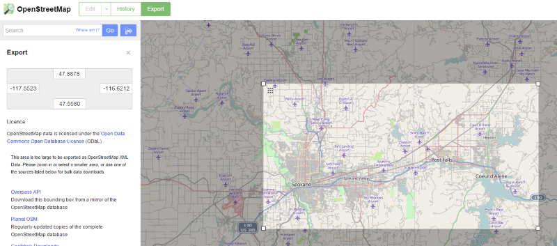

# OpenStreetMap Data Wrangling with MongoDB - Udacity Nanodegree Project 2
####By Kaan Divringi

**Abstract:** 
>This project is about working with an OpenStreetMap dataset covering the two cities of Pullman, WA and Coeur d'Alene, ID. In the process of processing the XML to JSON format, the street name irregularities were fixed. After importing the data into MongoDB, postal codes, state and city names were fixed in the database using the pymongodb interface. An initial overview of the dataset reveals incomplete postal code/state address field coverage in the dataset. In order to do location based queries, the pos field of the node objects was transformed into the GeoJSON format and indexed. Amenity information around the two major cities were compared. After coming up with a polygon representation for each state, node membership in WA vs ID were compared as well as the distributions of natural features between the states. The dataset was found to be relatively incomplete, especially outside of the Spokane area.


##Map Area
*Pullman, WA and Coeur d'Alene, ID - USA*



##Problems Encountered
###Street Names
Running the analysis script that I completed from lesson 6, we were able to expose some street naming problems. By iterating over the script and adding the new types of street names to my expected list I was able to fix most of the issues, which were limited to inconsistent street names from abbreviations (St or St. for Street, etc...). 

It three cases, the street name was missing a suffix completely. For these cases, used a *Gold Standard* data source (Google Maps) and found the missing abbreviations. I fixed them by adding special one-off cases to the mapping dictionary: `"Arthur":"Arthur St",`, `"Wellesley":"Wellesley Avenue",` and `"Main":"Main Avenue",`.

The last irregularity was the entry for State Highway 41. This is an accurate street name but it is the only one of its kind to show up in this audit script. There are several other highways of the type "primary" in this map area, how come this is the only one to show up in this audit? Looking at the greater context of where this appears, it is in an address context (tag keyword starting with addr:) so it is denoting a type of node such as a building. Since it is less common for highways to link directly to buildings, this at least seems plausible. In the area which I have chosen, it does seem like it is the only one.

These issues were dealt with before uploading into the database. Subsequent issues are dealt with within MongoDB.

###Postal Codes
From the results of the following aggregation pipeline, I was able to determine that there are a number of issues with the postal code entries

```
pipeline = [{"$match":{"address.postcode":{"$exists":1}}},
            {"$group":{"_id":None, "postalCodes":{"$addToSet":"$address.postcode"}}}]
```

Issues include:

* **Merged with other address fields**: 'WA 99206', 'Spokane, WA 99218'
* **Non-numeric data**: 'WA'
* **Non postal code numbers**: '189872421:189872425'

As far as I could tell, all of the postal codes returned were in the area of interest (Washington State in the 99004-99260 range and Idaho State in the 83801-83858 range).

For the merged address fields, the total number of offending entries is 3. However, in the spirit of data wrangling where the dataset may be overly large to fix it manually, I'd like to present the following code to programmatically fix it:
```
import re
pattern = r'(?P<city>\w+)?,? ?(?P<state>[A-Z][A-Z]) (?P<postcode>\d{5})'
pat = re.compile(pattern)

for entry in docs.find({"address.postcode":{"$regex":pattern}}):
    mdict = re.match(pat, entry['address']['postcode']).groupdict()
    entry['address']['postcode'] = mdict['postcode']
    entry['address']['state'] = mdict['state']
    if mdict['city']:
        entry['address']['city'] = mdict['city']
    docs.save(entry)
```


The non-numeric data case was resolved by moving the WA field from the postcode field to the state field:
```
docs.update({"address.postcode":"WA"},{"$set":{"address.state":"WA"},"$unset":{"address.postcode":""}}, multi=True)
```

The in the third issue, the incorrect postal code occurred in 3 entries and is not, as far as I can tell, a lattitude:longitude number. In each of the three entries there is a tiger:zip_right tag with a zip code that is apparently correct. I assume that this is from the [TIGER dataset](http://wiki.openstreetmap.org/wiki/TIGER) from the US Census Bureau overlaid onto the OSM dataset. Post codes from the TIGER data set are used to replace the erroneous post code information with the following code:

```
docs.update({"address.postcode":'189872421:189872425'}, {"$set":{"address.postcode":"99224"}}, multi=True)
```

While there was also an inconsistency in some of the post codes having an extra 4 digits (`99218-1929`), these were not removed due to the fact that they are extra data and aggregation type work on zip codes is not anticipated at this time. As is shown later in the dataset, there is not good enough post code coverage in the dataset to make it a valuable tool.

###Cities and State Address Fields
In the spirit of the above, we can apply very similar pipelines to see if there are Uniformity issues in the City and State address fields.
```
states_pipeline = [{"$match":{"address.state":{"$exists":1}}},
                    {"$group":{"_id":None, "states":{"$addToSet":"$address.state"}}}]
cities_pipeline = [{"$match":{"address.city":{"$exists":1}}},
                    {"$group":{"_id":None, "cities":{"$addToSet":"$address.city"}}}]
```

As for the states, the only irregularities were two instances of WA being in lower case. This is easily fixed:
```
docs.update({"address.state":"wa"},{"$set":{"address.state":"WA"}}, multi=True)
```

For the cities there were a variety of issues:

* **Merged address fields**: 'Otis Orchards, WA', 'Liberty Lake, WA', 'Post Falls, ID', 'Spokane Valley, WA', 'Spokane, Washington', 'Spokane Valley, Washington'
* **Inconsistant captilization**: spokane
* **Inconsistant spellings of Coeur d'Alene**: Coeur d"Alene, Coeur d Alene

The following code fixes the above issues:
```
docs.update({"address.city":"spokane"}, {"$set":{"address.city":"Spokane"}}, multi=True)
docs.update({"address.city":{"$regex":"Coeur d[^']Alene"}}, {"$set": {"address.city":"Coeur d'Alene"}}, multi=True)

pattern = r'([\W\w]+), (\w+)'
pat = re.compile(pattern)
for entry in docs.find({"address.city":{"$regex":pattern}}):
    mgroups = re.match(pat,entry['address']['city']).groups()
    if mgroups[1] in ["WA", "ID"]:
        entry['address']['state'] = mgroups[1]
    elif mgroups[1] == "Washington":
        entry['address']['state'] = "WA"
    entry['address']['city'] = mgroups[0]
    docs.save(entry)
```

Now that the data cleaned, the rest of the code will be live executed in the IPython Notebook

##Data Overview
The size of my downloaded dataset was 56.675 MB

More information about the dataset generated programmatically below


    %matplotlib inline
    from pymongo import MongoClient
    client = MongoClient("mongodb://localhost:27017")
    db = client.osm_project
    docs = db.docs
    
    #Total number of Documents
    print "Total # of documents: ", docs.count()
    
    #Total number of nodes, ways
    print "Total number of Nodes: %i, Ways: %i" % \
                                    (docs.find({"type":"node"}).count(),
                                     docs.find({"type":"way"}).count())
    
    #Total number of unique users
    users_set = docs.aggregate({"$group":{"_id":None, "users":{"$addToSet":"$created.user"}}})['result'][0]['users']
    print "Number of unique users: %i" % len(users_set)
    
    #Number of entries in WA, ID or None by state field
    print "Total number of entries in WA: ", docs.find({"address.state":"WA"}).count()
    print "Total number of entries in ID: ", docs.find({"address.state":"ID"}).count()
    print "Total number of entries without state field: ", docs.find({"address.state":{"$exists":0}}).count()
    #Above but by postcode field
    print "Total number of entries in a WA zip code: ", docs.find({"address.postcode":{"$regex":"^99"}}).count()
    print "Total number of entries in a ID zip code: ", docs.find({"address.postcode":{"$regex":"^83"}}).count()
    print "Total number of entries with no zip code: ", docs.find({"address.postcode":{"$exists":0}}).count()
    
    #print "Spokane ", docs.find({"address.city":"Spokane"}).count()
    #print "Coeur d'Alene", docs.find({"address.city":"Coeur d'Alene"}).count()

    Total # of documents:  266875
    Total number of Nodes: 241729, Ways: 25144
    Number of unique users: 315
    Total number of entries in WA:  82
    Total number of entries in ID:  49
    Total number of entries without state field:  266744
    Total number of entries in a WA zip code:  410
    Total number of entries in a ID zip code:  102
    Total number of entries with no zip code:  266363
    


    import pandas as pd
    import matplotlib.pyplot as plt
    import numpy as np
    
    #Top 10 users by # of contributions
    all_users = docs.aggregate([{"$group": {"_id":"$created.user", "contributions": {"$sum":1}}},
                               {"$sort": {"contributions":-1}}])['result']
    all_users_index = [item.pop('_id') for item in all_users]
    users = pd.DataFrame(all_users, index=all_users_index)
    pos= np.arange(0,10)
    plt.figure(figsize=(12,12))
    plt.bar(pos,users.contributions[:10])
    plt.xlabel("User")
    plt.ylabel("# of Contributions")
    plt.title("Top 10 Users by Contributions")
    ticks=plt.xticks(pos+0.5,users.index[:10])


    #General Statistics about all users
    users.contributions.describe()


    count      315.000000
    mean       847.222222
    std       5729.845011
    min          1.000000
    25%          2.000000
    50%         21.000000
    75%        141.000000
    max      92327.000000
    Name: contributions, dtype: float64


    #City centers defined in dataset
    pd.DataFrame(docs.aggregate([{"$match":{"place":"city"}}, 
                   {"$project":{"Name":"$name", "Population":"$population", "Position":"$pos"}}])['result'])


<div style="max-height:1000px;max-width:1500px;overflow:auto;">
<table border="1" class="dataframe">
  <thead>
    <tr style="text-align: right;">
      <th></th>
      <th>Name</th>
      <th>Population</th>
      <th>Position</th>
      <th>_id</th>
    </tr>
  </thead>
  <tbody>
    <tr>
      <th>0</th>
      <td>       Spokane</td>
      <td> 208916</td>
      <td> [47.6588603, -117.4247134]</td>
      <td> 553d7eceb31fc3660d3d240f</td>
    </tr>
    <tr>
      <th>1</th>
      <td> Coeur d'Alene</td>
      <td>  41328</td>
      <td> [47.6776832, -116.7804664]</td>
      <td> 553d7ed0b31fc3660d3ec829</td>
    </tr>
    <tr>
      <th>2</th>
      <td>    Post Falls</td>
      <td>  30123</td>
      <td>  [47.715147, -116.9480651]</td>
      <td> 553d7ed0b31fc3660d3ec868</td>
    </tr>
  </tbody>
</table>
</div>


    #Amenities in dataset (limited to top 20)
    
    pd.DataFrame(docs.aggregate([{"$match":{"amenity":{"$exists":1}}}, 
                                 {"$group":{"_id":"$amenity", "count":{"$sum":1}}},
                                 {"$sort":{"count":-1}},
                                 {"$limit":20}])['result'])


<div style="max-height:1000px;max-width:1500px;overflow:auto;">
<table border="1" class="dataframe">
  <thead>
    <tr style="text-align: right;">
      <th></th>
      <th>_id</th>
      <th>count</th>
    </tr>
  </thead>
  <tbody>
    <tr>
      <th>0 </th>
      <td>          parking</td>
      <td> 740</td>
    </tr>
    <tr>
      <th>1 </th>
      <td>           school</td>
      <td> 224</td>
    </tr>
    <tr>
      <th>2 </th>
      <td>       restaurant</td>
      <td>  64</td>
    </tr>
    <tr>
      <th>3 </th>
      <td>        fast_food</td>
      <td>  44</td>
    </tr>
    <tr>
      <th>4 </th>
      <td>          toilets</td>
      <td>  33</td>
    </tr>
    <tr>
      <th>5 </th>
      <td> place_of_worship</td>
      <td>  31</td>
    </tr>
    <tr>
      <th>6 </th>
      <td>             fuel</td>
      <td>  28</td>
    </tr>
    <tr>
      <th>7 </th>
      <td>       grave_yard</td>
      <td>  20</td>
    </tr>
    <tr>
      <th>8 </th>
      <td>          shelter</td>
      <td>  16</td>
    </tr>
    <tr>
      <th>9 </th>
      <td>             cafe</td>
      <td>  16</td>
    </tr>
    <tr>
      <th>10</th>
      <td>     fire_station</td>
      <td>  14</td>
    </tr>
    <tr>
      <th>11</th>
      <td>         hospital</td>
      <td>  13</td>
    </tr>
    <tr>
      <th>12</th>
      <td>             bank</td>
      <td>  12</td>
    </tr>
    <tr>
      <th>13</th>
      <td>          library</td>
      <td>  11</td>
    </tr>
    <tr>
      <th>14</th>
      <td>      post_office</td>
      <td>   8</td>
    </tr>
    <tr>
      <th>15</th>
      <td>         pharmacy</td>
      <td>   8</td>
    </tr>
    <tr>
      <th>16</th>
      <td>              pub</td>
      <td>   7</td>
    </tr>
    <tr>
      <th>17</th>
      <td>    swimming_pool</td>
      <td>   5</td>
    </tr>
    <tr>
      <th>18</th>
      <td>      marketplace</td>
      <td>   5</td>
    </tr>
    <tr>
      <th>19</th>
      <td>         post_box</td>
      <td>   5</td>
    </tr>
  </tbody>
</table>
</div>


##Additional Ideas
###Geospatial Data - Points
Due to the lack of coverage of address tags in the nodes in the dataset, location data remains as the only reliable way to determine spatial information about the dataset. In order to do any sort of location based query we will have to make use of the geospatial data in the OSM dataset. It's probably not a coincidence that we took special care to have the location field be in the MongoDB legacy 2D point format as we extracted it from the dataset. We will be converting said format to the new 2DSphere format for the features/ease of use. The 2DSphere format takes coordinates in longitude, latitude  order (opposite of how we encoded it):
```
#Note: This is quite slow. Probably a better way to do this, ie through the update function or something
for node in docs.find({"type":"node"}):
    node['pos'] = {'type':'Point', 'coordinates':[node['pos'][1], node['pos'][0]]}
    docs.save(node)
```

After the above, we will need to create an special geospatial index in order to run the geospacial queries on the field:
```
nodes = docs.find({"type":"node"})
nodes.collection.create_index([("pos", "2dsphere")])
```

Now a variety of geospacial queries are available to us. For the `$near` query, it was necessary to use a version of a dict object that preserved the order, or else there were errors. It's possible an ordered dict would have sufficed but I used the solution I got from [here](http://stackoverflow.com/questions/20883420/pymongo-asyncmongo-maxdistance-not-working). 


    from bson import SON
    spokane = docs.find_one({"name":"Spokane", "place":"city"})
    coeur = docs.find_one({"name":"Coeur d'Alene", "place":"city"})
    def city_center_near(city, miles=10.0): 
        return SON([("$geometry", city['pos']), ('$maxDistance', miles*1609.344)])
    
    #Selected amenities around (within 10 miles of) Spokane & Coeur d'Alene
    amenities = ['school', 'restaurant', 'fast_food', 'place_of_worship', 'hospital']
    spokane_amenities = docs.find({"amenity":{"$in":amenities}, "pos":{"$near": city_center_near(spokane)}})
    coeur_amenities = docs.find({"amenity":{"$in":amenities}, "pos":{"$near": city_center_near(coeur)}})
    
    amenities_df = pd.DataFrame(
        [dict([('city', "Spokane"), ("amenity", elem['amenity'])]) for elem in spokane_amenities] + 
        [dict([('city', "Coeur d'Alene"), ("amenity", elem['amenity'])]) for elem in coeur_amenities]
        )
    amenities_df.groupby(["amenity", "city"], as_index=False).count()


<div style="max-height:1000px;max-width:1500px;overflow:auto;">
<table border="1" class="dataframe">
  <thead>
    <tr style="text-align: right;">
      <th></th>
      <th></th>
      <th>amenity</th>
      <th>city</th>
    </tr>
    <tr>
      <th>amenity</th>
      <th>city</th>
      <th></th>
      <th></th>
    </tr>
  </thead>
  <tbody>
    <tr>
      <th rowspan="2" valign="top">fast_food</th>
      <th>Coeur d'Alene</th>
      <td>  2</td>
      <td>  2</td>
    </tr>
    <tr>
      <th>Spokane</th>
      <td>  5</td>
      <td>  5</td>
    </tr>
    <tr>
      <th rowspan="2" valign="top">hospital</th>
      <th>Coeur d'Alene</th>
      <td>  6</td>
      <td>  6</td>
    </tr>
    <tr>
      <th>Spokane</th>
      <td>  3</td>
      <td>  3</td>
    </tr>
    <tr>
      <th rowspan="2" valign="top">place_of_worship</th>
      <th>Coeur d'Alene</th>
      <td>  4</td>
      <td>  4</td>
    </tr>
    <tr>
      <th>Spokane</th>
      <td> 12</td>
      <td> 12</td>
    </tr>
    <tr>
      <th rowspan="2" valign="top">restaurant</th>
      <th>Coeur d'Alene</th>
      <td>  1</td>
      <td>  1</td>
    </tr>
    <tr>
      <th>Spokane</th>
      <td> 18</td>
      <td> 18</td>
    </tr>
    <tr>
      <th rowspan="2" valign="top">school</th>
      <th>Coeur d'Alene</th>
      <td> 34</td>
      <td> 34</td>
    </tr>
    <tr>
      <th>Spokane</th>
      <td> 96</td>
      <td> 96</td>
    </tr>
  </tbody>
</table>
</div>


###Geospatial Data - Polygons
The geolocation facilities of MongoDB can also be used to test whether nodes are within a polygonal shaped area. In the OSM schema, polygons representing things like state boundaries, city limits and county boundaries are encoded in the `relation` tag. This tag references a series of `way` tags, which in turn reference a series of `node` tags to finally get the coordinates. While the `relation` tag was not parsed from the OSM XML file into JSON format for upload into the MongoDB, it is something that could be added as they are quite similar in structure to ways. Reconstructing a polygon from the information in the `relation` tag would seem to involve:
1. Following the references from relations to ways
2. From ways to nodes
3. Extract coordinates for each node along the entire shape
  - The order would need to be maintained (a regular dictionary may not be an appropriate representation to parse from the original XML file)
4. Build polygon geometry in GeoJSON format with all points, perhaps store in way document entry

The polygons will probably need to be created in advance, as it may get computationally expensive to create them for the first time.

This was something I originally researched in order to compare entries from the different states. The state line is [defined as a relation](http://www.openstreetmap.org/relation/162116#map=6/44.418/-110.984) investigating this on the OSM wiki lead to the above conclusions. For my current project, however, I can make a simplifying assumption: the division between Washington and Idaho in my map area is [nearly a straight line](http://www.openstreetmap.org/way/108436386#map=10/47.6746/-116.9989). I can pick a single longitude value and, combined with the bounding box information of my map area, create a *WA Box* and *ID Box* polygon to test membership in either state. This approach should suffice for my current dataset.


    dividing_long = -117.039971
    # Bounds of current map geometry. Had to extend mins/maxes to match total number of nodes (precision issue)
    long_max = -116.6212 + 2e-3
    long_min = -117.5523 - 2e-3
    lat_max = 47.8878 + 2e-3
    lat_min = 47.5580 - 2e-3
    
    # There is a separate box geometry operator but I wanted to demonstrate the polygon one 
    wa_box = {"type":"Polygon",
              "coordinates":[ [ [long_min, lat_max], [long_min, lat_min], 
                               [dividing_long, lat_min], [dividing_long, lat_max], [long_min, lat_max] ] ]}
    
    id_box = {"type":"Polygon",
              "coordinates":[ [ [dividing_long, lat_max], [dividing_long, lat_min], 
                               [long_max, lat_min], [long_max, lat_max], [dividing_long, lat_max] ] ]}
    
    wa_nodes = docs.find({"type":"node", "pos":{"$geoWithin":{"$geometry":wa_box}}}).count()
    id_nodes = docs.find({"type":"node", "pos":{"$geoWithin":{"$geometry":id_box}}}).count()
    
    print "WA nodes:%i + ID nodes:%i = %i (should be 241729)" % (wa_nodes, id_nodes, wa_nodes + id_nodes)
    

    WA nodes:147184 + ID nodes:94545 = 241729 (should be 241729)
    

Rather than simply looking at the number of nodes in each state, we can look at the number and type of natural features in the two states in this map area. Since Coeur d'Alene is near a bay, there are quite a few more bay natural features in the Idaho side of the map area. The most common natural feature by far, however, are trees and Washington has many of them, likely due to the multiple parks on the Washington side of the map area. The Idaho section of the map likely has more than 0 trees in reality, though.


    naturals = docs.aggregate([{"$match":{"natural":{"$exists":1}}}, 
                               {"$group":{"_id":"$natural", "count":{"$sum":1}}}, 
                               {"$sort":{"count":-1}},
                              ])['result']
    top_nats = [elem['_id'] for elem in naturals]
    n_idaho = {}
    n_wash = {}
    for nat in top_nats:
        n_wash[nat] = docs.find({"natural":nat,"pos":{"$geoWithin":{"$geometry":wa_box}}}).count()
        if n_wash[nat]==0: n_wash.pop(nat)
        n_idaho[nat] = docs.find({"natural":nat,"pos":{"$geoWithin":{"$geometry":id_box}}}).count()
        if n_idaho[nat]==0: n_idaho.pop(nat)
    
    shared_nats = set(n_wash.keys()).intersection(n_idaho.keys())
    
    plt.subplot(121)
    plt.pie([n_wash[nat] for nat in shared_nats], labels=shared_nats)
    plt.title("Washington Natural Features")
    plt.axis('equal')
    plt.subplot(122)
    plt.pie([n_idaho[nat] for nat in shared_nats], labels=shared_nats)
    plt.title("Idaho Natural Features")
    plt.axis('equal')
    plt.show()
    
    print "Washington: ", n_wash
    print "Idaho: ", n_idaho


    Washington:  {u'spring': 1, u'tree': 216, u'bay': 6, u'wood': 23, u'peak': 22, u'cliff': 1}
    Idaho:  {u'bay': 29, u'peak': 26, u'beach': 4, u'cliff': 1}
    

##Conclusion
The dataset analyzed was interesting given that it covered two states and two main cities, though Spokane is about 5 times larger. It is clear that there are some coverage holes in the data, however. While I don't expect address entries for each node, there were quite a few more amenities defined than had the full addresses. There are also some gaps in defining the amenities, more so in Coeur d'Alene than in Spokane. Does it seem plausible that a city a fifth of the size of Spokane has twice the hospitals? Or that a city that size has only one restaurant? This points to some gaps in filling out the individual businesses in this area.

It may be interesting to look at the dataset again with the regions properly defined. The city limits of Spokane and Coeur d'Alene are not perfect circles, in fact, they are polygonal shapes. Going through the work of parsing the `relation` tags and reconstructing the polygons would, I think be interesting. In addition, we could look at some other lesser known counties, though they are not likely to be well populated with data if the larger cities are any indication.

All in all it was an interesting dataset to work with. It was very nice to have the website openstreetmap.org, which functioned as a nice visual browsing interface for the data. That's not something that most datasets will have.


    
